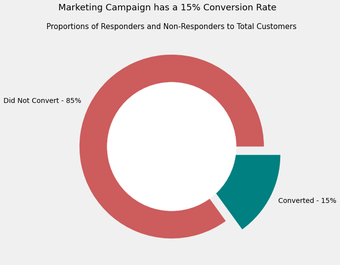
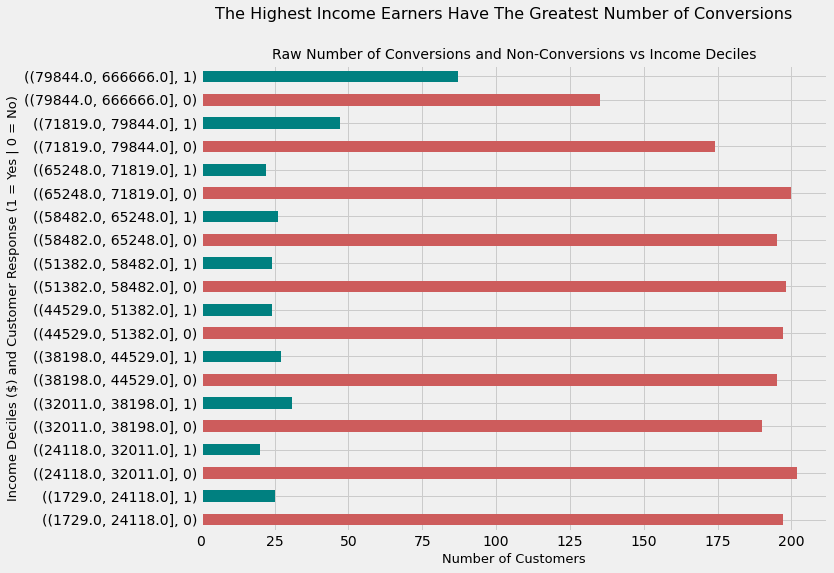
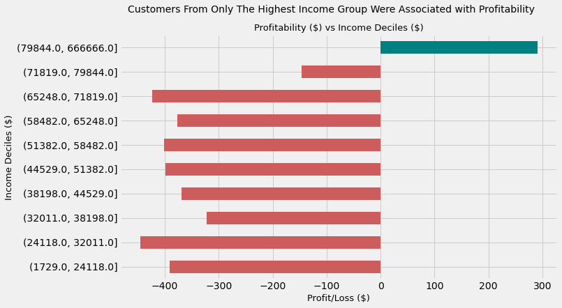
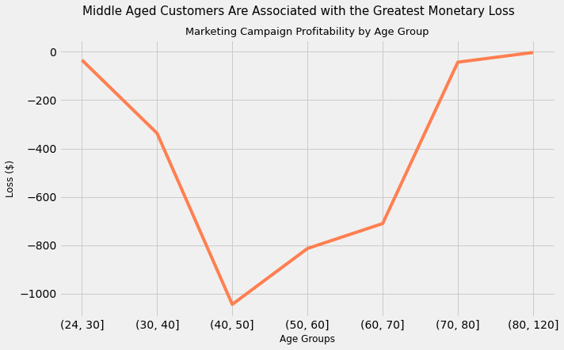
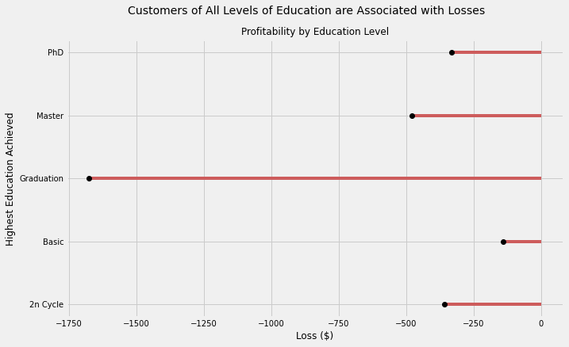
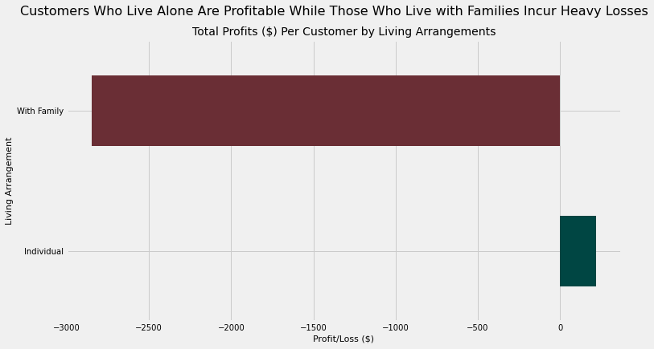
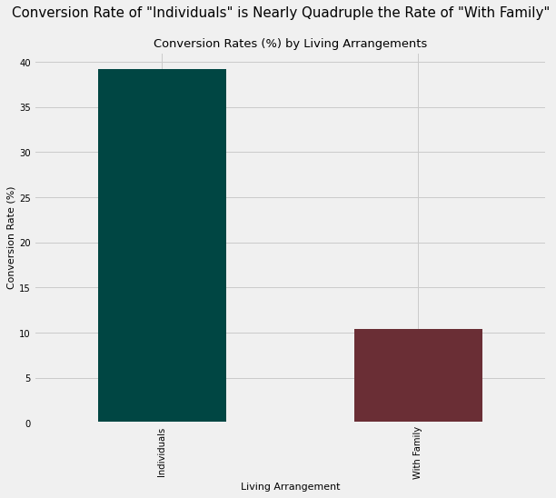
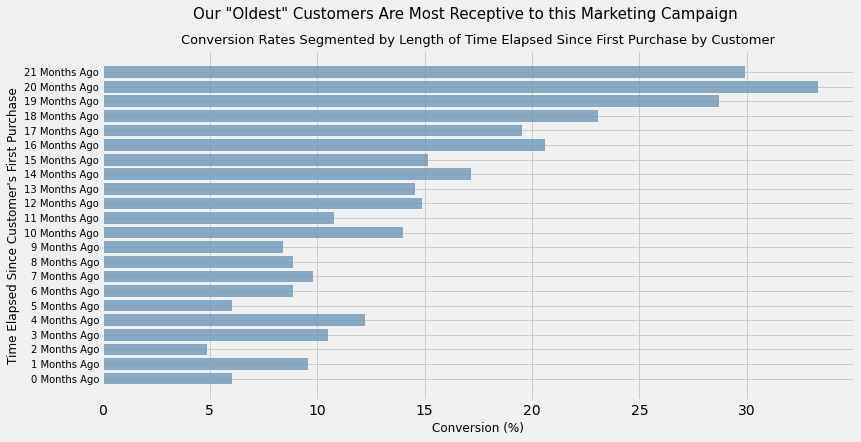
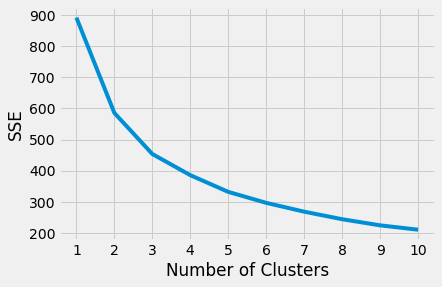

{\rtf1\ansi\ansicpg1252\cocoartf2636
\cocoatextscaling0\cocoaplatform0{\fonttbl\f0\fswiss\fcharset0 Helvetica;\f1\fnil\fcharset0 HelveticaNeue;\f2\fnil\fcharset0 HelveticaNeue-Italic;
}
{\colortbl;\red255\green255\blue255;\red0\green0\blue0;\red255\green255\blue255;}
{\*\expandedcolortbl;;\cssrgb\c0\c0\c0;\cssrgb\c100000\c100000\c100000;}
{\*\listtable{\list\listtemplateid1\listhybrid{\listlevel\levelnfc23\levelnfcn23\leveljc0\leveljcn0\levelfollow0\levelstartat1\levelspace360\levelindent0{\*\levelmarker \{disc\}}{\leveltext\leveltemplateid1\'01\uc0\u8226 ;}{\levelnumbers;}\fi-360\li720\lin720 }{\listname ;}\listid1}
{\list\listtemplateid2\listhybrid{\listlevel\levelnfc23\levelnfcn23\leveljc0\leveljcn0\levelfollow0\levelstartat1\levelspace360\levelindent0{\*\levelmarker \{disc\}}{\leveltext\leveltemplateid101\'01\uc0\u8226 ;}{\levelnumbers;}\fi-360\li720\lin720 }{\listname ;}\listid2}
{\list\listtemplateid3\listhybrid{\listlevel\levelnfc23\levelnfcn23\leveljc0\leveljcn0\levelfollow0\levelstartat1\levelspace360\levelindent0{\*\levelmarker \{disc\}}{\leveltext\leveltemplateid201\'01\uc0\u8226 ;}{\levelnumbers;}\fi-360\li720\lin720 }{\listname ;}\listid3}}
{\*\listoverridetable{\listoverride\listid1\listoverridecount0\ls1}{\listoverride\listid2\listoverridecount0\ls2}{\listoverride\listid3\listoverridecount0\ls3}}
\paperw11900\paperh16840\margl1440\margr1440\vieww11520\viewh8400\viewkind0
\pard\tx720\tx1440\tx2160\tx2880\tx3600\tx4320\tx5040\tx5760\tx6480\tx7200\tx7920\tx8640\pardirnatural\partightenfactor0

\f0\fs24 \cf0 # Introduction\
\
## Problem exposition and Business Value\
\
Marketing Campaigns can be considered a call to action for customers and they can be of any kind. For example, they can involve giving customers a discount, giving customers something for free, collecting points on a membership card, offering free delivery, offering additional credit and so on. \
\
Regardless of the exact nature of any campaign, what is important is that different types of customers respond differently to different types of campaigns; customers in a specific segment may respond well to one campaign and poorly to another.\
\
By finding out in advance what customer segments are more likely to respond well to a given marketing campaign, we can target those customers. This will encourage a higher conversion percentage and, ultimately, higher profitability.\
\
Therefore, this analysis is aimed at finding \
\
- different customer segments for this particular campaign\
- which segments responds well and which do not\
- conversion percentages and associated profitability for each customer segment, broken down by customer characteristics such as income, living arrangements, monthly amount spent on meat products and more\
- clusters within this customer data so that subsequent marketing campaigns can target customers more effectively\
\
In this case, our marketing campaign offers a discount on certain products to customers. The cost per customer of such a campaign is $3 while a successful conversion results in a per-customer revenue of $5.\
\
\
## Data\
\
**Data source**: This data is obtained from Kaggle and can be found in the Git repository\
\
**Observations**: It contains 2216 observations where each observation represents a customer who converted or did not convert\
\
**Features**: There are 35 features in total with a mix of interval and categorical data types. A few examples are:\
\expnd0\expndtw0\kerning0
\outl0\strokewidth0 \strokec2 \
\pard\tx220\tx720\pardeftab720\li720\fi-720\partightenfactor0
\ls1\ilvl0\cf0 \cb3 \kerning1\expnd0\expndtw0 \outl0\strokewidth0 - \expnd0\expndtw0\kerning0
\outl0\strokewidth0 \strokec2 Complain - 1 if customer complained in the last 2 years\cb1 \
\ls1\ilvl0\cb3 \kerning1\expnd0\expndtw0 \outl0\strokewidth0 - \expnd0\expndtw0\kerning0
\outl0\strokewidth0 \strokec2 DtCustomer - date of customer\'92s enrolment with the company\cb1 \
\ls1\ilvl0\cb3 \kerning1\expnd0\expndtw0 \outl0\strokewidth0 - \expnd0\expndtw0\kerning0
\outl0\strokewidth0 \strokec2 Education - customer\'92s level of education\cb1 \
\ls1\ilvl0\cb3 \kerning1\expnd0\expndtw0 \outl0\strokewidth0 - \expnd0\expndtw0\kerning0
\outl0\strokewidth0 \strokec2 Marital - customer\'92s marital status\cb1 \
\pard\tx220\tx720\pardeftab720\li720\fi-720\partightenfactor0
\ls2\ilvl0\cf0 \cb3 \kerning1\expnd0\expndtw0 \outl0\strokewidth0 - \expnd0\expndtw0\kerning0
\outl0\strokewidth0 \strokec2 MntFishProducts - amount spent on fish products in the last 2 years\cb1 \
\pard\tx720\pardeftab720\partightenfactor0
\cf0 \strokec2 - \cb3 \strokec2 NumCatalogPurchases - number of purchases made using catalogue\cb1 \strokec2 \
- \cb3 \strokec2 NumStorePurchases - number of purchases made directly in stores\cb1 \strokec2 \
\pard\tx720\tx1440\tx2160\tx2880\tx3600\tx4320\tx5040\tx5760\tx6480\tx7200\tx7920\tx8640\pardirnatural\partightenfactor0
\cf0 \kerning1\expnd0\expndtw0 \outl0\strokewidth0 \
**Outcome variable**: The outcome variable is called Response it is\cb3 \expnd0\expndtw0\kerning0
 1 if customer accepted the offer in the last campaign and 0 otherwise\cb1 \kerning1\expnd0\expndtw0 \
\
\
# Approach and Insights\
\
## Data Cleaning\
\
The dataset is fairy complete with only 24 values missing for the \'93Income\'94 variable. These rows were subsequently dropped because the loss in data is miniscule. A check for extreme values highlighted 3 customers whose ages were 121, 115 and 114. These values seemed very unlikely but I did not remove them as, again, they represent only a vanishingly small proportion of the data\
\
On the whole, the dataset is fairly clean.\
\
## EDA and Key Findings\
\
For EDA, I chose a select number of features to explore their relationship with the outcome variable (Response) and the profitability of the customer segments represented. \
\
Here are the key findings:\
\
- The marketing campaign (MC) had a moderate overall conversion rate of 15%:\
\
\pard\tx720\tx1440\tx2160\tx2880\tx3600\tx4320\tx5040\tx5760\tx6480\tx7200\tx7920\tx8640\pardirnatural\partightenfactor0
\cf0 \
\pard\tx720\tx1440\tx2160\tx2880\tx3600\tx4320\tx5040\tx5760\tx6480\tx7200\tx7920\tx8640\pardirnatural\partightenfactor0
\cf0 \
- The total loss incurred by the MC was $2,985 so it was a significantly unsuccessful MC overall\
\
- The highest income earners had the greatest number and percentage of conversions, with the highest 2 income deciles having conversion percentages of 39.19% and 21.27% respectively:\
\
\pard\tx720\tx1440\tx2160\tx2880\tx3600\tx4320\tx5040\tx5760\tx6480\tx7200\tx7920\tx8640\pardirnatural\partightenfactor0
\cf0 \
\
- Customers in only the highest income decile were associated with profitability, when segmented by income:\
\
\
\
\
- When segmented by age, all customer groups were associated with losses apart from those in the 80-120 group, which broke even:\
\
\
\
- When segmented by education level, all customer groups were associated with losses \
\
\
\
\
\
- When segmented by living arrangements, customers who lived alone (without spouses or children) were associated with profitability. Those who lived with spouses or children were associated with heavy losses\
\
\
\
\pard\tx720\tx1440\tx2160\tx2880\tx3600\tx4320\tx5040\tx5760\tx6480\tx7200\tx7920\tx8640\pardirnatural\partightenfactor0
\cf0 \
- This was unsurprising as the conversion rate of customers living alone was nearly 4 times the conversion rate of their counterparts\
\
\pard\tx720\tx1440\tx2160\tx2880\tx3600\tx4320\tx5040\tx5760\tx6480\tx7200\tx7920\tx8640\pardirnatural\partightenfactor0
\cf0 \
\
\
- When segmented by the length of time an individual had been a customer of our company, our \'93oldest\'94 customers tended to have the greatest conversion rates\
\
\
\pard\tx720\tx1440\tx2160\tx2880\tx3600\tx4320\tx5040\tx5760\tx6480\tx7200\tx7920\tx8640\pardirnatural\partightenfactor0
\cf0 \
\
\
# Clustering\
\
I used the elbow method to find out the optimal number of clusters to choose with K-Means Clustering, which turned out to be 4\
\
\pard\tx720\tx1440\tx2160\tx2880\tx3600\tx4320\tx5040\tx5760\tx6480\tx7200\tx7920\tx8640\pardirnatural\partightenfactor0
\cf0 \
\pard\tx720\tx1440\tx2160\tx2880\tx3600\tx4320\tx5040\tx5760\tx6480\tx7200\tx7920\tx8640\pardirnatural\partightenfactor0
\cf0 \
\
Interestingly, a single cluster (cluster 2) contained contained all 333 customers who converted. These customers:\
\
\pard\tx220\tx720\pardeftab720\li720\fi-720\partightenfactor0
\ls3\ilvl0
\f1\fs28 \cf0 \cb3 - \expnd0\expndtw0\kerning0
\outl0\strokewidth0 \strokec2 Have the greatest average income at $60209\cb1 \
\
- \cb3 Have 3 teens per 10 homes on average. So while these customers are not completely teen-less, they tend to live with fewer teens on average than customers in other clusters [specifically Cluster 3 (about 7 teens per 10 homes) and Cluster 2 (more than 1 teen per home)]\cb1 \
\
- \cb3 Spend the most on wine per month at $502\cb1 \
\
- \cb3 Spend the most on meat products per month at $294\cb1 \
\
- \cb3 Spend the\'a0
\f2\i second most
\f1\i0 \'a0on gold products per month at\'a0$61, with customers in Cluster 3 spending the most ($66)\cb1 \
\
- \cb3 Make the most purchases through catalogues at 4.2. The frequency of purchase is not listed in the meta information of the dataset, but it is reasonable to assume in the absence of information that points otherwise that this frequency is monthly\cb1 \
\
- \cb3 Make the most purchases through the Web at 5. Again, this is assuming a monthly figure\cb1 \
\
- \cb3 Are usually among our oldest customers (in terms of how long they've been with the company, not their Age), with an average of 449 days since their first purchase. However, they are not\'a0
\f2\i the
\f1\i0 \'a0oldest group of customers. Those belong to cluster 3 which, it should be reiterated, did not have a single customer convert\cb1 \
\pard\tx720\tx1440\tx2160\tx2880\tx3600\tx4320\tx5040\tx5760\tx6480\tx7200\tx7920\tx8640\pardirnatural\partightenfactor0

\f0\fs24 \cf0 \kerning1\expnd0\expndtw0 \outl0\strokewidth0 \
}